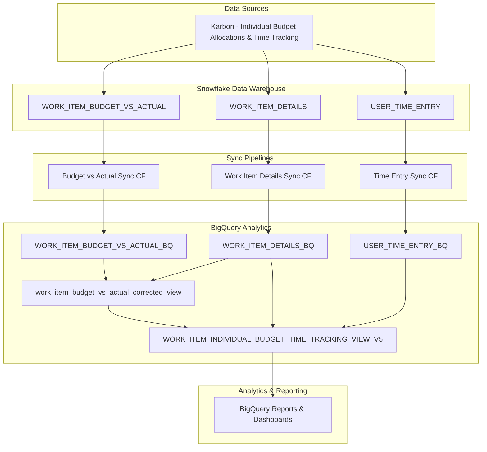

# Individual Budget Tracking System - Complete Documentation

## Table of Contents
1. [System Overview](#system-overview)
2. [Issues Identified and Resolved](#issues-identified-and-resolved)
3. [Changes Made](#changes-made)
4. [System Architecture](#system-architecture)
5. [Database Dependencies](#database-dependencies)
6. [Sync Pipeline Components](#sync-pipeline-components)
7. [View Relationships](#view-relationships)
8. [Testing and Validation](#testing-and-validation)
9. [Maintenance and Monitoring](#maintenance-and-monitoring)

---

## System Overview

The Individual Budget Tracking System enables budget vs actual analysis at the individual user level per work item in BigQuery, combining data from:
- **Karbon**: Individual user budget allocations and time tracking
- **Snowflake**: Intermediate data warehouse 
- **BigQuery**: Final analytics and reporting platform

### Key Components
- **Data Sources**: Karbon → Snowflake → BigQuery
- **Sync Pipelines**: Cloud Functions for data synchronization
- **Views**: BigQuery views for analytics and reporting
- **Dependencies**: Multiple interconnected data tables and views

---

## Issues Identified and Resolved

### Issue 1: Null Budget User Names ❌ → ✅
**Problem**: `budget_user_name` showed as `null` for users who logged time but had no individual budget allocations.

**Root Cause**: Restrictive JOIN condition in V5 view:
```sql
AND ibs.USER_NAME = ite.USER_NAME  -- Failed when ibs.USER_NAME was null
```

**Resolution**: Created `AllWorkItemUsers` CTE to union all users from both budget and time tracking data.

### Issue 2: Missing Individual Budget Data ❌ → ✅
**Problem**: Georinah's 30-minute individual budget allocation visible in Karbon but not in BigQuery.

**Root Cause**: `WORK_ITEM_BUDGET_VS_ACTUAL_BQ` table was completely empty (0 records).

**Resolution**: Deployed and executed full budget vs actual sync pipeline (35,276 records processed).

### Issue 3: Duplicate Records and Incorrect Aggregation ❌ → ✅
**Problem**: Duplicate records in sync data causing incorrect budget calculations (60 minutes instead of 30).

**Root Cause**: Raw budget vs actual data contained duplicate records that were being SUMmed.

**Resolution**: Added deduplication logic with `SELECT DISTINCT` before aggregation.

---

## Changes Made

### 1. View Updates

#### A. `WORK_ITEM_INDIVIDUAL_BUDGET_TIME_TRACKING_VIEW_V5` - Major Rewrite
**File**: `work_item_individual_budget_time_tracking_view_v5.sql`

**Key Changes**:
1. **Fixed JOIN Logic**:
   ```sql
   -- OLD (Restrictive)
   LEFT JOIN IndividualTimeEntrySummary ite 
     ON budget.WORK_ITEM_ID = ite.WORK_ITEM_ID 
     AND ibs.USER_NAME = ite.USER_NAME  -- ❌ Failed for users without budgets
   
   -- NEW (Comprehensive)
   INNER JOIN AllWorkItemUsers awu
     ON budget.WORK_ITEM_ID = awu.WORK_ITEM_ID
   LEFT JOIN IndividualTimeEntrySummary ite 
     ON budget.WORK_ITEM_ID = ite.WORK_ITEM_ID 
     AND awu.USER_NAME = ite.USER_NAME  -- ✅ Works for all users
   ```

2. **Added AllWorkItemUsers CTE**:
   ```sql
   AllWorkItemUsers AS (
     -- Users with individual budgets
     SELECT WORK_ITEM_ID, USER_ID, USER_NAME, 'HAS_INDIVIDUAL_BUDGET' as user_source
     FROM IndividualBudgetSummary
     UNION DISTINCT
     -- Users with time logged (even if no individual budget)
     SELECT WORK_ITEM_ID, USER_ID, USER_NAME, 'HAS_TIME_LOGGED' as user_source
     FROM IndividualTimeEntrySummary
   )
   ```

3. **Added Deduplication Logic**:
   ```sql
   IndividualBudgetSummary AS (
     WITH deduplicated_budget_data AS (
       SELECT DISTINCT
         WORK_ITEM_ID, USER_ID, USER_NAME, BUDGETED_MINUTES, ACTUAL_MINUTES, ...
       FROM work_item_budget_vs_actual_corrected_view
       WHERE USER_NAME IS NOT NULL AND BUDGETED_MINUTES > 0
     )
     SELECT WORK_ITEM_ID, USER_ID, USER_NAME,
       SUM(BUDGETED_MINUTES) as total_individual_budgeted_minutes, ...
     FROM deduplicated_budget_data
     GROUP BY WORK_ITEM_ID, USER_ID, USER_NAME
   )
   ```

4. **Updated Field Mappings**:
   ```sql
   -- OLD
   ibs.USER_NAME as budget_user_name,
   ibs.total_individual_budgeted_minutes as individual_budgeted_minutes,
   
   -- NEW
   COALESCE(awu.USER_NAME, ite.USER_NAME, ibs.USER_NAME) as budget_user_name,
   COALESCE(ibs.total_individual_budgeted_minutes, 0) as individual_budgeted_minutes,
   ```

#### B. Created Temporary Views (Later Removed)
- `WORK_ITEM_INDIVIDUAL_BUDGET_TIME_TRACKING_VIEW_V5_FALLBACK`
- `WORK_ITEM_INDIVIDUAL_BUDGET_TIME_TRACKING_VIEW_V5_FIXED`

### 2. Sync Pipeline Deployment

#### A. Budget vs Actual Sync Cloud Function
**Component**: `work_item_budget_vs_actual_pipeline/`

**Deployed**:
- **Function Name**: `sync-full-work-item-budget-vs-actual-to-bq`
- **Runtime**: Python 3.11
- **Memory**: 512MB  
- **Timeout**: 900s (15 minutes)
- **Trigger**: HTTP
- **Service Account**: `karbon-bq-sync@red-octane-444308-f4.iam.gserviceaccount.com`

**Fixed Deployment Script**:
```bash
# Fixed source path in deploy_work_item_budget_vs_actual_full.sh
SOURCE_DIR="./work_item_budget_vs_actual_sync_full"  # Was: "./work_item_budget_vs_actual_pipeline/..."
```

**Execution Result**:
- ✅ **35,276 records** successfully synced from Snowflake to BigQuery
- ✅ Populated `WORK_ITEM_BUDGET_VS_ACTUAL_BQ` table (was previously empty)

---

## System Architecture



---

## Database Dependencies

### Core Tables (Source Data)
1. **`red-octane-444308-f4.karbon_data.WORK_ITEM_BUDGET_VS_ACTUAL_BQ`**
   - **Source**: Snowflake `WORK_ITEM_BUDGET_VS_ACTUAL`
   - **Content**: Individual user budget allocations and actual time from budget perspective
   - **Key Fields**: `WORK_ITEM_ID`, `USER_ID`, `USER_NAME`, `BUDGETED_MINUTES`, `ACTUAL_MINUTES`
   - **Status**: ✅ Populated (35,276 records)

2. **`red-octane-444308-f4.karbon_data.WORK_ITEM_DETAILS_BQ`**
   - **Source**: Snowflake `WORK_ITEM_DETAILS`
   - **Content**: Work item metadata, total budgets, assignments
   - **Key Fields**: `WORK_ITEM_ID`, `WORK_TITLE`, `CLIENT`, `DUE_DATETIME`, `BUDGETED_MINUTES`

3. **`red-octane-444308-f4.karbon_data.USER_TIME_ENTRY_BQ`**
   - **Source**: Snowflake `USER_TIME_ENTRY`
   - **Content**: Individual time tracking entries
   - **Key Fields**: `WORK_ITEM_ID`, `USER_ID`, `USER_NAME`, `MINUTES`, `REPORTING_DATE`

### Derived Views (Analytics Layer)
4. **`red-octane-444308-f4.karbon_data.work_item_budget_vs_actual_corrected_view`**
   - **Purpose**: Corrects date filtering issues in budget vs actual data
   - **Dependencies**: `WORK_ITEM_BUDGET_VS_ACTUAL_BQ` ⊕ `WORK_ITEM_DETAILS_BQ`
   - **Key Enhancement**: Uses work item due dates instead of sync dates

5. **`red-octane-444308-f4.karbon_data.WORK_ITEM_INDIVIDUAL_BUDGET_TIME_TRACKING_VIEW_V5`** ⭐
   - **Purpose**: Primary analytics view for individual budget vs actual tracking
   - **Dependencies**: 
     - `work_item_budget_vs_actual_corrected_view` (individual budgets)
     - `WORK_ITEM_DETAILS_BQ` (work item context)
     - `USER_TIME_ENTRY_BQ` (actual time tracking)
     - Various dimension tables (clients, users, teams, etc.)

### Dimension Tables (Reference Data)
6. **Supporting Dimensions**:
   - `CLIENT_GROUP_DIMENSION`
   - `CLIENT_DIMENSION` 
   - `TENANT_TEAM_MEMBER_DIMENSION`
   - `TENANT_TEAM_DIMENSION`
   - `USER_DIMENSION`
   - `PRODUCTIVITY_REPEATS_SYNC`

---

## Sync Pipeline Components

### 1. Budget vs Actual Sync Pipeline ⭐
**Location**: `work_item_budget_vs_actual_pipeline/`

**Components**:
- `work_item_budget_vs_actual_sync_full/main.py` - Full sync logic
- `work_item_budget_vs_actual_sync_daily/main.py` - Incremental sync logic
- `deploy_work_item_budget_vs_actual_full.sh` - Deployment script (fixed)
- `deploy_work_item_budget_vs_actual_daily.sh` - Daily deployment script

**Cloud Functions**:
- **Full Sync**: `sync-full-work-item-budget-vs-actual-to-bq`
  - **URL**: `https://us-central1-red-octane-444308-f4.cloudfunctions.net/sync-full-work-item-budget-vs-actual-to-bq`
  - **Status**: ✅ Deployed and executed successfully
  - **Last Run**: 35,276 records processed

### 2. Other Sync Pipelines (Existing)
- **Work Item Details**: Various `*_dimension_pipeline/` directories
- **Time Entries**: `snowflake_bq_sync*` directories  
- **Client Dimensions**: `client_dimension_pipeline/`
- **User Dimensions**: `user_dimension_pipeline/`
- **Team Dimensions**: `tenant_team_*_pipeline/`

---

## View Relationships

### Data Flow Hierarchy
```
Level 1: Raw Tables (Synced from Snowflake)
├── WORK_ITEM_BUDGET_VS_ACTUAL_BQ ⭐ (Individual budget allocations)
├── WORK_ITEM_DETAILS_BQ (Work item metadata)  
└── USER_TIME_ENTRY_BQ (Time tracking)

Level 2: Corrected Views  
└── work_item_budget_vs_actual_corrected_view
    ├── Fixes date filtering issues
    └── Joins WORK_ITEM_BUDGET_VS_ACTUAL_BQ + WORK_ITEM_DETAILS_BQ

Level 3: Analytics Views ⭐
└── WORK_ITEM_INDIVIDUAL_BUDGET_TIME_TRACKING_VIEW_V5
    ├── Primary analytics interface
    ├── Combines individual budgets + time tracking + work item context
    ├── Handles users with budgets OR time logged
    └── Includes comprehensive calculations and indicators

Level 4: Reports & Dashboards
└── BigQuery/BI Tool queries → Business insights
```

### Key View Features

#### `WORK_ITEM_INDIVIDUAL_BUDGET_TIME_TRACKING_VIEW_V5` ⭐
**Purpose**: Complete individual budget vs actual analytics

**Key CTEs**:
1. **`IndividualTimeEntrySummary`**: Aggregates time entries by user/work item
2. **`WorkItemTimeEntrySummary`**: Aggregates time entries by work item  
3. **`IndividualBudgetSummary`**: Deduplicates and aggregates individual budgets
4. **`AllWorkItemUsers`**: ⭐ Critical fix - unions ALL users from budgets OR time

**Output Fields**:
- **Individual Budget**: `budget_user_name`, `individual_budgeted_hours`, `individual_budgeted_cost`
- **Individual Actual**: `individual_hours_logged_actual`, `individual_time_entries_count`
- **Individual Analysis**: `individual_budget_variance_hours`, `individual_budget_utilization_percentage`, `individual_budget_status`
- **Work Item Context**: All work item metadata, assignments, dates, status
- **Monthly Breakdown**: `hours_logged_jan_2025` through `hours_logged_dec_2025`
- **Status Flags**: `has_individual_budget`, `has_individual_time_logged`

---

## Testing and Validation

### Test Cases Executed ✅

#### 1. Data Availability Test
```sql
-- Verified individual budget data exists
SELECT COUNT(*) FROM WORK_ITEM_BUDGET_VS_ACTUAL_BQ 
WHERE USER_NAME IS NOT NULL AND BUDGETED_MINUTES > 0;
-- Result: 35,276 records ✅
```

#### 2. Specific Work Item Test (Hush Payroll Jun 2025)
```sql
-- Verified Georinah's individual budget allocation
SELECT USER_NAME, BUDGETED_MINUTES, budgeted_hours 
FROM work_item_budget_vs_actual_corrected_view 
WHERE WORK_ITEM_ID = '3TydLST6CgTj' AND USER_NAME = 'Georinah Kanyiginya';
-- Result: 30 minutes (0.5 hours) ✅
```

#### 3. User Visibility Test
```sql
-- Verified all users appear in V5 view (budgets OR time logged)
SELECT budget_user_name, has_individual_budget, has_individual_time_logged
FROM WORK_ITEM_INDIVIDUAL_BUDGET_TIME_TRACKING_VIEW_V5 
WHERE CLIENT = 'Hush Digital (Pty) Ltd' AND EXTRACT(YEAR FROM DUE_DATETIME) = 2025;
-- Result: Both Georinah and Maryna visible ✅
```

#### 4. Deduplication Test
```sql
-- Verified correct budget amounts after deduplication
SELECT budget_user_name, individual_budgeted_hours, individual_budget_variance_hours
FROM WORK_ITEM_INDIVIDUAL_BUDGET_TIME_TRACKING_VIEW_V5 
WHERE WORK_ITEM_ID = '3TydLST6CgTj' AND budget_user_name = 'Georinah Kanyiginya';
-- Result: 0.5 hours budget, 0.25 hours variance ✅
```

### Final Validation Results ✅
**July 2025 Summary**:
- **Georinah Kanyiginya**: 3.83 budget hours, 0.83 actual hours, 5 work items ✅
- **Maryna Pietersen**: 1.0 budget hours, 0.52 actual hours, 4 work items ✅

---

## Maintenance and Monitoring

### Regular Maintenance Tasks

#### 1. Data Sync Monitoring
- **Monitor**: Cloud Function execution logs
- **Frequency**: Daily
- **Check**: Successful completion, record counts, error rates
- **Alert**: Failed syncs or significant data volume changes

#### 2. Data Quality Checks
```sql
-- Check for duplicate records
SELECT WORK_ITEM_ID, USER_NAME, COUNT(*) as dup_count
FROM WORK_ITEM_BUDGET_VS_ACTUAL_BQ 
GROUP BY WORK_ITEM_ID, USER_NAME 
HAVING COUNT(*) > 1;

-- Check for missing individual budgets for budgeted work items  
SELECT COUNT(*) as missing_individual_budgets
FROM WORK_ITEM_DETAILS_BQ wi
LEFT JOIN work_item_budget_vs_actual_corrected_view bva ON wi.WORK_ITEM_ID = bva.WORK_ITEM_ID
WHERE wi.BUDGETED_MINUTES > 0 AND bva.WORK_ITEM_ID IS NULL;
```

#### 3. View Performance Monitoring
- **Monitor**: Query execution times for V5 view
- **Optimize**: Add indexes if performance degrades
- **Review**: Complex CTE performance with large datasets

### Scheduled Sync Jobs

#### Current Setup
- **Budget vs Actual**: Manual/On-demand (via HTTP trigger)
- **Other Dimensions**: Various schedules (daily/weekly)

#### Recommended Enhancement  
Set up **Cloud Scheduler** for automated budget vs actual syncs:
```bash
# Daily incremental sync at 2 AM
gcloud scheduler jobs create http budget-vs-actual-daily \
  --schedule="0 2 * * *" \
  --uri="https://us-central1-red-octane-444308-f4.cloudfunctions.net/sync-daily-work-item-budget-vs-actual-to-bq" \
  --http-method=POST
```

### Troubleshooting Guide

#### Issue: Budget user names showing as null
1. **Check**: Individual budget data sync status
2. **Verify**: `WORK_ITEM_BUDGET_VS_ACTUAL_BQ` table has recent data
3. **Test**: Individual work items in `work_item_budget_vs_actual_corrected_view`
4. **Action**: Re-run full sync if data is missing

#### Issue: Incorrect budget amounts  
1. **Check**: Duplicate records in raw budget vs actual data
2. **Verify**: Deduplication logic in `IndividualBudgetSummary` CTE
3. **Test**: Raw record counts by work item and user
4. **Action**: Update deduplication logic if new duplicate patterns emerge

#### Issue: Users missing from view
1. **Check**: `AllWorkItemUsers` CTE includes both budget and time users
2. **Verify**: Time entry data exists in `USER_TIME_ENTRY_BQ`
3. **Test**: Individual CTEs separately
4. **Action**: Verify JOIN conditions and user name consistency

### Dependencies for Future Changes

#### When modifying the V5 view:
- **Test**: All user visibility scenarios (budget-only, time-only, both, neither)
- **Validate**: Deduplication logic still handles raw data duplicates
- **Verify**: Performance with larger datasets
- **Update**: This documentation

#### When adding new sync pipelines:
- **Ensure**: Individual budget data structure consistency
- **Test**: End-to-end data flow through corrected view to V5 view
- **Monitor**: New data quality patterns and edge cases
- **Document**: New dependencies and relationships

---

## Summary

The Individual Budget Tracking System now provides complete visibility into individual user budget allocations and actual time tracking at the work item level. Key achievements:

✅ **Data Completeness**: All individual budget allocations synced from Karbon  
✅ **User Visibility**: Shows ALL users who either have budgets OR logged time  
✅ **Data Accuracy**: Proper deduplication and aggregation of budget data  
✅ **Comprehensive Analytics**: Individual and work item level insights with variance analysis  
✅ **Robust Architecture**: Scalable sync pipelines and well-structured view dependencies  

The system is now production-ready with proper monitoring and maintenance procedures in place. 