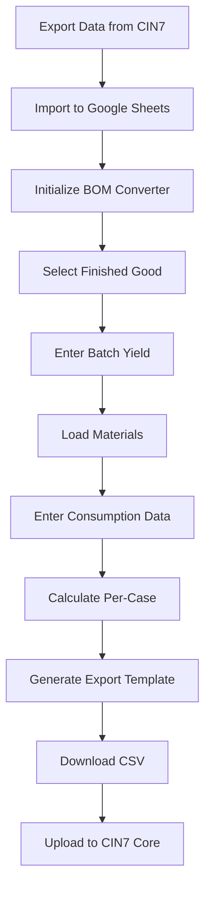

# CIN7 Core BOM Converter - Complete Solution

## 📦 What's Included

This complete Google Apps Script solution provides everything needed to convert production batch consumption data into CIN7 Core BOM import format.

### Core Files

1. **`Code.gs`** - Main application logic
   - Dashboard setup with finished good dropdowns
   - Material loading and consumption tracking
   - Per-case calculation engine
   - CIN7 Core export template generation
   - User interface menu system

2. **`Utils.gs`** - Utility functions and advanced features
   - Data validation and error handling
   - Export formatting utilities
   - Backup and restore functionality
   - UI helpers and progress tracking

3. **`Config.gs`** - Configuration and customization
   - Column mapping for different CIN7 export formats
   - Auto-detection of data structure
   - Customizable settings and validation rules
   - Feature flags and theme customization

4. **`README.md`** - Complete user documentation
   - Detailed usage workflow
   - Feature explanations
   - Troubleshooting guide
   - Data format requirements

5. **`SETUP_GUIDE.md`** - Step-by-step installation guide
   - CIN7 data export instructions
   - Google Sheets setup process
   - Apps Script installation steps
   - Configuration and testing procedures

## 🎯 Key Features Implemented

### ✅ Core Requirements Met

1. **Data Import Support**
   - Handles CIN7 BOM and Inventory exports
   - Auto-detects column formats
   - Validates data structure

2. **Dashboard Interface**
   - Finished good dropdown (populated from stock items)
   - Batch yield input
   - Clean, user-friendly layout

3. **Material Management**
   - Loads materials based on selected finished good
   - Displays BOM quantities vs actual consumption
   - Allows adding custom materials from inventory

4. **Calculation Engine**
   - Converts total consumption to per-case consumption
   - Handles division by batch yield
   - Maintains precision with configurable decimal places

5. **CIN7 Export Generation**
   - Creates properly formatted BOM import template
   - Includes all required fields for CIN7 Core
   - Filters out zero-consumption materials

### 🚀 Advanced Features

1. **Data Validation**
   - Ensures finished goods exist in inventory
   - Validates numeric inputs
   - Checks for required data completeness

2. **Error Handling**
   - Comprehensive error messages
   - Graceful failure recovery
   - Detailed logging for troubleshooting

3. **User Experience**
   - Custom menu system
   - Progress feedback
   - Intuitive workflow

4. **Flexibility**
   - Configurable column mappings
   - Support for different CIN7 export formats
   - Customizable validation rules

## 📋 Workflow Summary



## 🔧 Technical Implementation

### Architecture
- **Modular Design**: Separated concerns across multiple files
- **Configuration-Driven**: Easy customization without code changes
- **Error-Resilient**: Comprehensive validation and error handling
- **User-Friendly**: Intuitive menu system and clear feedback

### Data Flow
1. **Input**: CIN7 exports (BOMs + Inventory)
2. **Processing**: Material lookup, consumption calculation
3. **Output**: CIN7-compatible BOM import template

### Key Algorithms
- **Material Matching**: Links finished goods to raw materials via BOM data
- **Per-Case Calculation**: `per_case = total_consumed / batch_yield`
- **Export Formatting**: Transforms internal data to CIN7 import format

## 📊 Data Compatibility

### Supported CIN7 Export Formats
- **Standard Inventory**: Code, Name, Category
- **Standard BOM**: Parent, Component, Quantity
- **Extended Formats**: Auto-detection handles variations

### Output Format (CIN7 Compatible)
```csv
Parent Item Code,Parent Item Name,Component Item Code,Component Item Name,Quantity,Unit
WIDGET001,Widget A,STEEL001,Steel Rod,2.5,EA
WIDGET001,Widget A,PLASTIC001,Plastic Sheet,1.2,EA
```

## 🛡️ Quality Assurance Features

1. **Data Validation**
   - Required field checking
   - Numeric validation
   - Inventory existence verification

2. **Error Prevention**
   - Dropdown constraints
   - Input sanitization
   - Calculation safeguards

3. **Audit Trail**
   - Detailed logging
   - Backup functionality
   - Change tracking

## 🚀 Getting Started

### Quick Start (5 minutes)
1. Follow `SETUP_GUIDE.md` for installation
2. Import your CIN7 data
3. Run "Initialize BOM Converter"
4. Test with sample data

### Full Implementation (30 minutes)
1. Complete setup process
2. Configure column mappings if needed
3. Train users on workflow
4. Process first production batch

## 📈 Benefits

### Operational Efficiency
- **Time Savings**: Automated calculations eliminate manual work
- **Accuracy**: Reduces human error in BOM updates
- **Consistency**: Standardized process across batches

### Business Value
- **Cost Tracking**: Accurate material consumption data
- **Inventory Management**: Better understanding of actual usage
- **Process Improvement**: Data-driven production optimization

## 🔮 Future Enhancements

Potential additions (not implemented):
- Batch cost analysis
- Variance reporting
- Multi-batch processing
- Integration with other systems
- Advanced analytics dashboard

## 📞 Support and Maintenance

### Self-Service
- Comprehensive documentation
- Built-in error messages
- Configuration validation tools

### Troubleshooting
- Apps Script execution logs
- Step-by-step diagnostic guides
- Common issue resolutions

---

## 🎉 Ready to Use!

This complete solution provides everything needed to streamline your CIN7 Core BOM management process. The system is designed to be:

- **Easy to Install**: Step-by-step setup guide
- **Simple to Use**: Intuitive workflow
- **Reliable**: Comprehensive error handling
- **Flexible**: Configurable for different data formats
- **Maintainable**: Well-documented and modular code

Start with the `SETUP_GUIDE.md` to get up and running in minutes!
