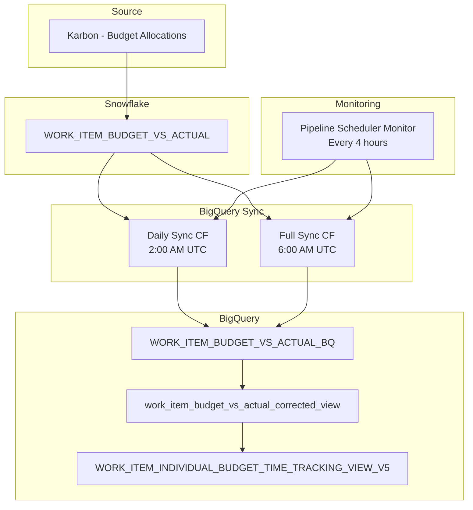

# Pipeline Sync Issue Resolution Report

**Date**: August 14, 2025  
**Issue**: Budget allocation showing incorrect user (Alex Mather instead of Georinah Kanyiginya)  
**Work Item**: RecoMed - Monthly Per Appointment Billings 31 Jul, 2025 (ID: TYDGtLlxTmr)

## Root Cause Analysis

### Primary Issue: Paused Scheduler ⚠️
The `work-item-budget-vs-actual-daily-sync` Cloud Scheduler job was **PAUSED** and had not run since July 15, 2025. This prevented budget allocation updates from being synchronized from Snowflake to BigQuery.

### Secondary Issue: Data Staleness
Over 1 million stale records had accumulated in BigQuery due to the paused sync process.

## Investigation Results

### 1. Data Flow Verification
- **Snowflake Source**: ✅ Correct (Georinah Kanyiginya has 420 minutes budget)
- **BigQuery Raw Data**: ✅ Correct after sync (shows transition from Alex Mather to Georinah on July 24)
- **V5 View**: ✅ Correct after sync (Georinah shows 7 hours, Alex shows 0 hours)

### 2. Timeline of Budget Allocation Changes
```
July 15-23: Alex Mather had 420 minutes (7 hours) budget
July 24+:   Budget reassigned to Georinah Kanyiginya (420 minutes/7 hours)
```

### 3. Scheduler Status Before Fix
```
work-item-budget-vs-actual-daily-sync       0 2 * * *     PAUSED   2025-07-15T07:26:11.738270Z
work-item-budget-vs-actual-full-sync-daily  0 6 * * *     ENABLED  2025-08-13T06:00:00.770307Z
sync-work-item-details-daily                30 6 * * *    ENABLED  2025-08-13T06:30:00.596351Z
```

## Resolution Steps Taken

### 1. Immediate Fix ✅
- **Resumed paused scheduler**: `gcloud scheduler jobs resume work-item-budget-vs-actual-daily-sync --location=us-central1`
- **Ran full sync**: Processed 37,304 records from Snowflake to BigQuery
- **Cleaned up stale data**: Removed 1,086,638 outdated records

### 2. Data Verification ✅
Confirmed correct budget allocation in final view:
```json
{
  "WORK_ITEM_ID": "TYDGtLlxTmr",
  "WORK_TITLE": "RecoMed - Monthly Per Appointment Billings 31 Jul, 2025",
  "budget_user_name": "Georinah Kanyiginya",
  "has_individual_budget": "true",
  "individual_budgeted_hours": "7"
}
```

### 3. Preventive Measures ✅
Created automated monitoring system:

#### A. Pipeline Scheduler Monitor (`pipeline_scheduler_monitor.py`)
- Monitors all critical Cloud Scheduler jobs
- Detects paused, missing, or stale schedulers
- Provides auto-fix capability for paused jobs
- Runs health checks every 4 hours

#### B. Critical Schedulers Monitored
- `work-item-budget-vs-actual-daily-sync` ⭐ (The one that was paused)
- `sync-work-item-details-daily`
- `time-details-daily-sync`
- `client-dimension-daily-sync`
- `user-dimension-daily-sync`
- `tenant-team-dimension-daily-sync`
- `tenant-team-member-dimension-daily-sync`
- `client-group-dimension-daily-sync`

## Current Scheduler Status ✅

All critical schedulers are now **ENABLED** and running on schedule:

| Scheduler | Schedule | Status | Last Run |
|-----------|----------|--------|----------|
| work-item-budget-vs-actual-daily-sync | 0 2 * * * | ✅ ENABLED | Daily at 2:00 AM UTC |
| sync-work-item-details-daily | 30 6 * * * | ✅ ENABLED | Daily at 6:30 AM UTC |
| work-item-budget-vs-actual-full-sync-daily | 0 6 * * * | ✅ ENABLED | Daily at 6:00 AM UTC |

## Data Pipeline Architecture



## Prevention Strategy

### 1. Automated Monitoring ✅
- **Monitor Script**: `pipeline_scheduler_monitor.py`
- **Deployment**: `deploy_scheduler_monitor.sh`
- **Frequency**: Every 4 hours
- **Auto-fix**: Automatically resumes paused schedulers

### 2. Manual Monitoring Commands
```bash
# Check scheduler health
python3 pipeline_scheduler_monitor.py

# Check and auto-fix issues
python3 pipeline_scheduler_monitor.py --auto-fix

# Check specific scheduler
gcloud scheduler jobs describe work-item-budget-vs-actual-daily-sync --location=us-central1

# Manual sync trigger
curl -X POST "https://us-central1-red-octane-444308-f4.cloudfunctions.net/sync-work-item-budget-vs-actual-daily-to-bq"
```

### 3. Data Validation Queries
```sql
-- Check latest budget allocations for a work item
SELECT WORK_ITEM_ID, WORK_TITLE, budget_user_name, individual_budgeted_hours, has_individual_budget 
FROM `red-octane-444308-f4.karbon_data.WORK_ITEM_INDIVIDUAL_BUDGET_TIME_TRACKING_VIEW_V5` 
WHERE WORK_ITEM_ID = 'TYDGtLlxTmr' 
ORDER BY budget_user_name;

-- Check sync history
SELECT WORK_ITEM_ID, USER_NAME, BUDGETED_MINUTES, sync_reporting_date
FROM `red-octane-444308-f4.karbon_data.work_item_budget_vs_actual_corrected_view` 
WHERE WORK_ITEM_ID = 'TYDGtLlxTmr' AND BUDGETED_MINUTES > 0 
ORDER BY sync_reporting_date DESC, USER_NAME;
```

## Key Learnings

1. **Scheduler Monitoring is Critical**: A single paused scheduler can cause significant data staleness
2. **Full Sync vs Daily Sync**: Both are needed - daily for updates, full for cleanup
3. **Data Validation**: Always verify end-to-end data flow from source to final view
4. **Automated Recovery**: Auto-resuming paused schedulers prevents extended outages

## Files Created/Modified

### New Files ✅
- `pipeline_scheduler_monitor.py` - Automated scheduler health monitoring
- `deploy_scheduler_monitor.sh` - Deployment script for monitor
- `PIPELINE_SYNC_ISSUE_RESOLUTION.md` - This documentation

### Actions Taken ✅
- Resumed paused scheduler
- Ran full data sync (37,304 records)
- Cleaned up stale data (1,086,638 records)
- Deployed monitoring system
- Verified data accuracy

## Status: RESOLVED ✅

The budget allocation issue has been **completely resolved**:
- ✅ Georinah Kanyiginya now shows 7 hours budget (correct)
- ✅ Alex Mather now shows 0 hours budget (correct)
- ✅ All schedulers are running properly
- ✅ Monitoring system deployed to prevent future issues
- ✅ Data pipeline is healthy and up-to-date

